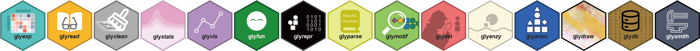
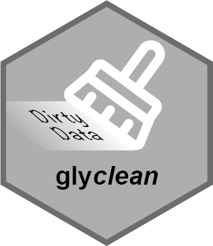
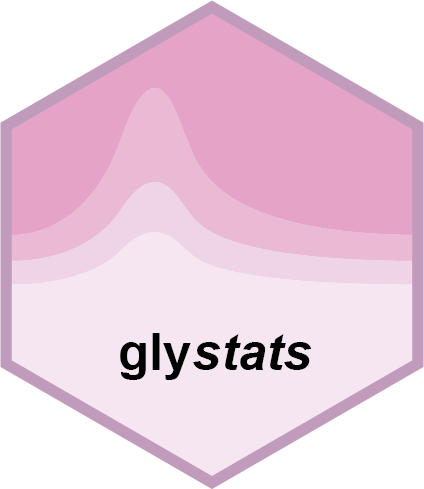
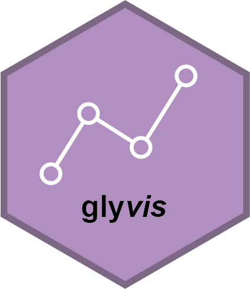
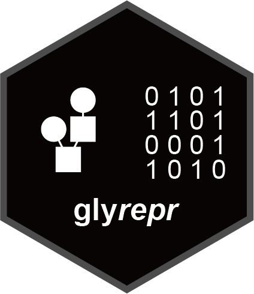
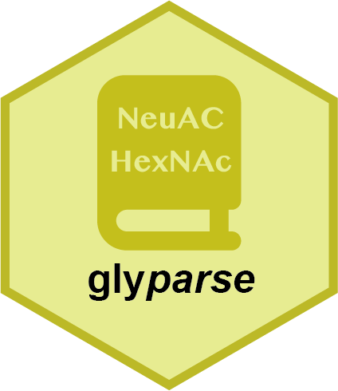
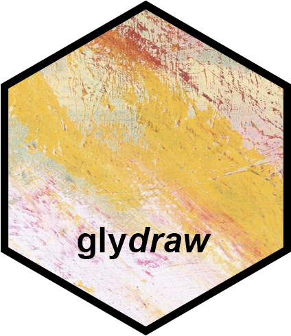
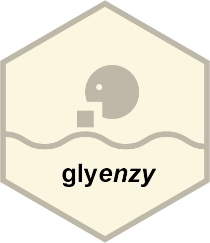
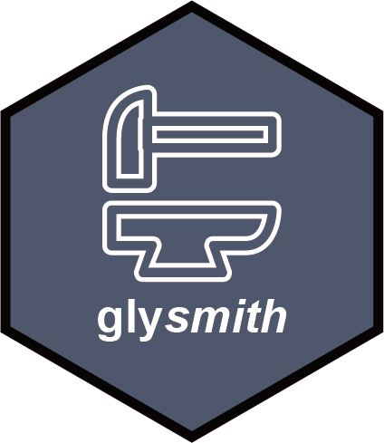

<!-- README.md is generated from README.Rmd. Please edit that file -->

<div align="center">


# glycoverse

**Glyco-Omics Data Analysis Made Easy**

A Tidyverse-style ecosystem for glycobiologists to turn raw MS data into
biological insights.

<!-- badges: start -->

[](https://lifecycle.r-lib.org/articles/stages.html#experimental)
[](https://www.r-project.org)
[](https://github.com/glycoverse/glycoverse/releases)
[](https://glycoverse.r-universe.dev/glycoverse)
[](https://app.codecov.io/gh/glycoverse/glycoverse)
[](https://lbesson.mit-license.org/)
[](https://github.com/amanzadi/awesome-glyco)
<!-- badges: end -->



</div>

## Overview

`glycoverse` is a comprehensive R ecosystem designed for glycomics and
glycoproteomics data analysis. It provides a unified pipeline that
covers the entire analytical workflow, from data import and cleaning to
statistical analysis and visualization. It also provides a dedicated
infrastructure for glycan structure analysis.

### Quick Start

``` r
library(glycoverse)

# Import results from Byonic and GlycoQuant
exp <- read_byonic_pglycoquant("result.csv", sample_info = "sample_info.csv")

# Preprocess
clean_exp <- auto_clean(exp)

# Derived trait analysis
trait_exp <- derive_traits(clean_exp)

# Statistical analysis
dea_res <- gly_anova(trait_exp)

# Use pipeline for a more concise workflow
dea_res <- exp |> 
  auto_clean() |> 
  derive_traits() |> 
  gly_anova()
```

### Packages

#### 🔬 Omics Data Analysis

Ecosystem units focusing on experimental data structures, automated
cleaning, robust statistical calculation and interactive downstream
plotting.

<table width="1100">
<tr>
<td align="center" valign="top" width="220">
<a href="https://github.com/glycoverse/glyexp"></a><br>
<a href="https://github.com/glycoverse/glyexp"><strong><code>glyexp</code></strong></a><br>
<sub>Data management &<br>experiment objects</sub>
</td>
<td align="center" valign="top" width="220">
<a href="https://github.com/glycoverse/glyread"></a><br>
<a href="https://github.com/glycoverse/glyread"><strong><code>glyread</code></strong></a><br>
<sub>Mass spectrometry<br>result importer</sub>
</td>
<td align="center" valign="top" width="220">
<a href="https://github.com/glycoverse/glyclean"></a><br>
<a href="https://github.com/glycoverse/glyclean"><strong><code>glyclean</code></strong></a><br>
<sub>Rule-based preprocessing</sub>
</td>
<td align="center" valign="top" width="220">
<a href="https://github.com/glycoverse/glystats"></a><br>
<a href="https://github.com/glycoverse/glystats"><strong><code>glystats</code></strong></a><br>
<sub>Statistical analysis</sub>
</td>
<td align="center" valign="top" width="220">
<a href="https://github.com/glycoverse/glyvis"></a><br>
<a href="https://github.com/glycoverse/glyvis"><strong><code>glyvis</code></strong></a><br>
<sub>Data visualization</sub>
</td>
</tr>
</table>

#### 🧬 Glycan Structure Analysis

Packages for representing, parsing, matching, deriving and drawing
glycan structures and traits.

<table width="1100">
<tr>
<td align="center" valign="top" width="220">
<a href="https://github.com/glycoverse/glyrepr"></a><br>
<a href="https://github.com/glycoverse/glyrepr"><strong><code>glyrepr</code></strong></a><br>
<sub>Glycan structure<br>representation</sub>
</td>
<td align="center" valign="top" width="220">
<a href="https://github.com/glycoverse/glyparse"></a><br>
<a href="https://github.com/glycoverse/glyparse"><strong><code>glyparse</code></strong></a><br>
<sub>IUPAC, WURCS,<br>GlycoCT parser</sub>
</td>
<td align="center" valign="top" width="220">
<a href="https://github.com/glycoverse/glymotif"></a><br>
<a href="https://github.com/glycoverse/glymotif"><strong><code>glymotif</code></strong></a><br>
<sub>Motif matching<br>and analysis</sub>
</td>
<td align="center" valign="top" width="220">
<a href="https://github.com/glycoverse/glydet"></a><br>
<a href="https://github.com/glycoverse/glydet"><strong><code>glydet</code></strong></a><br>
<sub>Derived trait<br>calculation</sub>
</td>
<td align="center" valign="top" width="220">
<a href="https://github.com/glycoverse/glydraw"></a><br>
<a href="https://github.com/glycoverse/glydraw"><strong><code>glydraw</code></strong></a><br>
<sub>Glycan structure<br>visualization</sub>
</td>
</tr>
</table>

#### 🧰 Optional Workflow Extensions

Additional packages for reference data, annotation, pathway context,
enrichment and full pipeline assembly.

<table width="1100">
<tr>
<td align="center" valign="top" width="220">
<a href="https://github.com/glycoverse/glydb"></a><br>
<a href="https://github.com/glycoverse/glydb"><strong><code>glydb</code></strong></a><br>
<sub>Curated glycan<br>database</sub>
</td>
<td align="center" valign="top" width="220">
<a href="https://github.com/glycoverse/glyanno"></a><br>
<a href="https://github.com/glycoverse/glyanno"><strong><code>glyanno</code></strong></a><br>
<sub>Composition and<br>structure annotation</sub>
</td>
<td align="center" valign="top" width="220">
<a href="https://github.com/glycoverse/glyenzy"></a><br>
<a href="https://github.com/glycoverse/glyenzy"><strong><code>glyenzy</code></strong></a><br>
<sub>Biosynthesis pathway<br>analysis</sub>
</td>
<td align="center" valign="top" width="220">
<a href="https://github.com/glycoverse/glyfun"></a><br>
<a href="https://github.com/glycoverse/glyfun"><strong><code>glyfun</code></strong></a><br>
<sub>Functional enrichment<br>analysis</sub>
</td>
<td align="center" valign="top" width="220">
<a href="https://github.com/glycoverse/glysmith"></a><br>
<a href="https://github.com/glycoverse/glysmith"><strong><code>glysmith</code></strong></a><br>
<sub>Full analytical<br>pipeline</sub>
</td>
</tr>
</table>

### glycoverse Meta-Package

This repository contains the `glycoverse` meta-package, which provides
convenient tools for managing the entire glycoverse ecosystem:

-   **One-command installation**: Install all core packages at once
-   **Package updates**: Update all glycoverse packages with a single
    function
-   **Situation report**: Check the status of all installed glycoverse
    packages

## Installation

### Install from r-universe (Recommended)

``` r
# install.packages("pak")
pak::repo_add(glycoverse = "https://glycoverse.r-universe.dev")
pak::pkg_install("glycoverse")
```

This installs the meta-package and all core packages: `glyexp`,
`glyread`, `glyclean`, `glystats`, `glyvis`, `glyrepr`, `glyparse`,
`glymotif`, `glydet`, and `glydraw`.

**Troubleshooting:** “Failed to download” or “403” errors usually
indicate network issues with r-universe rate limiting. Try switching
network environments or installing from GitHub.

### Install Individual Packages

``` r
pak::repo_add(glycoverse = "https://glycoverse.r-universe.dev")
pak::pkg_install("glymotif")  # Also installs dependencies: glyrepr, glyparse, glyexp
```

### Install from GitHub

<details>
<summary>
Click to expand detailed GitHub installation instructions
</summary>

**Prerequisite:** To install packages from GitHub, you’ll need the
proper compilation tools installed on your system. This means
[RTools](https://cran.r-project.org/bin/windows/Rtools/) for Windows and
[Xcode Command Line
Tools](https://developer.apple.com/documentation/xcode/installing-the-command-line-tools)
for macOS. Without them, you’ll likely see a “Could not find tools
necessary to compile a package” error. If you’re unsure about the
process, a quick search for “install R package from GitHub” will provide
helpful context on why these tools are necessary.

Installing from [GitHub](https://github.com/glycoverse/glycoverse) is a
little tricky. Package dependencies within glycoverse are resolved
assuming all packages are on r-universe (some on CRAN or Bioconductor).
It means that when running the following code:

``` r
# Do NOT run:
pak::pkg_install("glycoverse/glyxxx@*release")  # common practice to install a GitHub package
```

Installing glyxxx from GitHub in this way does not bypass R-universe
entirely, as its dependencies are still hosted there. If you are
experiencing network issues with R-universe, switching to the GitHub
version of glyxxx will not resolve the problem.

To truely install a glycoverse package from GitHub (along with all its
dependencies), you have to install them one by one following the
dependency tree:

``` r
pak::pkg_install("glyrepr")  # from CRAN
pak::pkg_install("glyparse")  # from CRAN
pak::pkg_install("glycoverse/glyexp@*release")
pak::pkg_install("glycoverse/glydraw@*release")
pak::pkg_install("glycoverse/glyread@*release")
pak::pkg_install("glycoverse/glyclean@*release")
pak::pkg_install("glycoverse/glystats@*release")
pak::pkg_install("glycoverse/glymotif@*release")
pak::pkg_install("glycoverse/glyvis@*release")
pak::pkg_install("glycoverse/glydet@*release")

# The meta-package
pak::pkg_install("glycoverse/glycoverse@*release")
```

**Note:** Check the DESCRIPTION file of each package to find its
dependencies.

**Troubleshooting:** Encountering an “HTTP error 403”? This usually
means your IP has been rate-limited by GitHub. To resolve this, you need
to configure a Personal Access Token (PAT).

1.  Sign up for a [GitHub](https://github.com) account.
2.  Install [Git](https://git-scm.com) on your local machine.
3.  Generate a PAT via your GitHub settings.
4.  Configure the PAT locally (e.g., using the `gitcreds` R package).

For a step-by-step guide, search for “How to set up GitHub PAT for R.”

</details>

### Install optional packages

`glydb`, `glyanno`, `glyenzy`, `glyfun`, and `glysmith` are installed
separately:

``` r
pak::pkg_install("glydb")
pak::pkg_install("glyanno")
pak::pkg_install("glyfun")
```

## Getting Started

### Using the meta-package

Load all core packages:

``` r
library(glycoverse)
#> ── Attaching core glycoverse packages ───────────────── glycoverse 0.3.1.9000 ──
#> ✔ glyclean 0.14.1          ✔ glyparse 0.6.0      
#> ✔ glydet   0.11.0          ✔ glyread  0.11.0     
#> ✔ glydraw  0.4.0           ✔ glyrepr  0.12.0     
#> ✔ glyexp   0.14.1          ✔ glystats 0.10.0.9000
#> ✔ glymotif 0.14.1          ✔ glyvis   0.6.0      
#> ── Conflicts ───────────────────────────────────────── glycoverse_conflicts() ──
#> ✖ glyclean::aggregate() masks stats::aggregate()
#> ℹ Use the conflicted package (<http://conflicted.r-lib.org/>) to force all conflicts to become errors
```

Check your installation:

``` r
glycoverse_sitrep()
```

### Learning Path

**For out-of-box analysis:** Start with
[glyexp](https://github.com/glycoverse/glyexp) →
[glyread](https://github.com/glycoverse/glyread) →
[glysmith](https://github.com/glycoverse/glysmith)

**For systematic learning:**

1.  Read the case studies:
    -   [Glycoproteomics
        Analysis](https://glycoverse.github.io/glycoverse-tutorial/tutorials/glycoproteomics.html)
    -   [Glycomics
        Analysis](https://glycoverse.github.io/glycoverse-tutorial/tutorials/glycomics.html)
2.  Follow the recommended learning order:
    -   Omics: [glyexp](https://github.com/glycoverse/glyexp) →
        [glyread](https://github.com/glycoverse/glyread) →
        [glyclean](https://github.com/glycoverse/glyclean) →
        [glystats](https://github.com/glycoverse/glystats) →
        [glyvis](https://github.com/glycoverse/glyvis)
    -   Structures: [glyrepr](https://github.com/glycoverse/glyrepr) →
        [glyparse](https://github.com/glycoverse/glyparse) →
        [glymotif](https://github.com/glycoverse/glymotif) →
        [glydet](https://github.com/glycoverse/glydet) →
        [glydraw](https://github.com/glycoverse/glydraw)

You might also find [glydb](https://github.com/glycoverse/glydb),
[glyanno](https://github.com/glycoverse/glyanno),
[glyenzy](https://github.com/glycoverse/glyenzy), and
[glyfun](https://github.com/glycoverse/glyfun) useful for specific
tasks.

### Updating Packages

``` r
# Update all glycoverse packages
glycoverse_update()

# List all dependencies
glycoverse_deps(recursive = TRUE)
```

## Important Notes

-   glycoverse v0.2.5+ uses r-universe for releases. Update the
    meta-package for better package management.
-   Updating the meta-package itself does not automatically update other
    glycoverse packages. Use `glycoverse_update()` for that.
