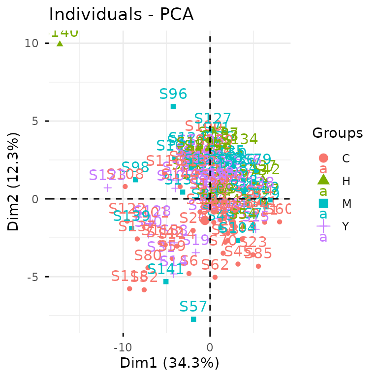

# Case Study: Glycomics

This vignette walks you through a complete glycomics analysis using
`glycoverse`. We’ll explore the full spectrum of glycomics data
analysis, from data loading and preprocessing to statistical analysis
and visualization. We’ll also dive into advanced glycan structure
analysis, including motif quantification and derived trait analysis.
Ready to dive in? Let’s go!

**Heads up:** `glycoverse` is built on `tidy` principles throughout. If
you’re new to `tidyverse` data analysis, we highly recommend checking
out Hadley Wickham’s excellent [R for Data
Science](https://r4ds.hadley.nz). Trust us, it’s worth the investment!

Quick readiness check:

- What’s a `tibble`?
- How do you filter rows in a `tibble`?
- What’s the modern alternative to `for` loops?
- What’s the `%>%` operator? Do we still need it?
- What makes data “tidy”?

## TL;DR

In case you’re in a hurry…

``` r
# Load the packages
library(tidyverse)
library(glycoverse)

# Preprocess the data
clean_exp <- auto_clean(real_experiment2)

# Perform PCA
pca_res <- gly_pca(clean_exp)
autoplot(pca_res)

# Perform differential expression analysis
limma_res <- gly_limma(clean_exp)
get_tidy_result(limma_res)

# Perform motif analysis
motifs <- c(
  motif1 = "Neu5Ac(??-?)Gal(??-?)GlcNAc(??-",
  motif2 = "Gal(??-?)GlcNAc(??-",
  motif3 = "GlcNAc(??-"
)
motif_exp <- quantify_motifs(clean_exp, motifs)
motif_anova_res <- gly_anova(motif_exp)
get_tidy_result(motif_anova_res, "main_test")

# Perform derived trait analysis
trait_exp <- derive_traits(clean_exp)
trait_anova_res <- gly_anova(trait_exp)
get_tidy_result(trait_anova_res, "main_test")
```

## Loading the Packages

We first load the `tidyverse` package, as usual.

``` r
library(tidyverse)
#> ── Attaching core tidyverse packages ──────────────────────── tidyverse 2.0.0 ──
#> ✔ dplyr     1.1.4     ✔ readr     2.1.6
#> ✔ forcats   1.0.1     ✔ stringr   1.6.0
#> ✔ ggplot2   4.0.1     ✔ tibble    3.3.1
#> ✔ lubridate 1.9.4     ✔ tidyr     1.3.2
#> ✔ purrr     1.2.1     
#> ── Conflicts ────────────────────────────────────────── tidyverse_conflicts() ──
#> ✖ dplyr::filter() masks stats::filter()
#> ✖ dplyr::lag()    masks stats::lag()
#> ℹ Use the conflicted package (<http://conflicted.r-lib.org/>) to force all conflicts to become errors
```

Just like `tidyverse`, `glycoverse` is a meta-package that loads a
collection of specialized packages all at once.

``` r
library(glycoverse)
#> ── Attaching core glycoverse packages ───────────────── glycoverse 0.2.3.9000 ──
#> ✔ glyclean 0.12.0     ✔ glyparse 0.5.3 
#> ✔ glydet   0.9.0      ✔ glyread  0.8.4 
#> ✔ glydraw  0.3.0      ✔ glyrepr  0.9.0 
#> ✔ glyexp   0.12.3     ✔ glystats 0.6.3 
#> ✔ glymotif 0.12.0     ✔ glyvis   0.5.0 
#> ── Conflicts ───────────────────────────────────────── glycoverse_conflicts() ──
#> ✖ glyclean::aggregate()  masks stats::aggregate()
#> ✖ dplyr::filter()        masks stats::filter()
#> ✖ lubridate::intersect() masks dplyr::intersect(), base::intersect()
#> ✖ dplyr::lag()           masks stats::lag()
#> ✖ glyexp::select_var()   masks dplyr::select_var()
#> ✖ lubridate::setdiff()   masks dplyr::setdiff(), base::setdiff()
#> ✖ dplyr::setequal()      masks base::setequal()
#> ✖ lubridate::union()     masks dplyr::union(), base::union()
#> ℹ Use the conflicted package (<http://conflicted.r-lib.org/>) to force all conflicts to become errors
```

## Reading the Data

Data import is typically your first step in any analysis. For this
tutorial, we’ll use the `real_experiment2` dataset that comes with
`glyexp`. This is a real-world N-glycomics dataset from 144 patients
across four liver conditions: healthy controls (H), hepatitis (M),
cirrhosis (Y), and hepatocellular carcinoma (C).

``` r
real_experiment2
#> 
#> ── Glycomics Experiment ────────────────────────────────────────────────────────
#> ℹ Expression matrix: 144 samples, 67 variables
#> ℹ Sample information fields: group <fct>
#> ℹ Variable information fields: glycan_composition <comp>, glycan_structure <struct>
```

For your own glycomics projects, you can create an `experiment()` object
manually. See [this
document](https://glycoverse.github.io/glyexp/articles/glyexp.html#building-your-own-data-empire)
for more details.

The `real_experiment2` object is an `experiment()` object. If you’ve
worked with `SummarizedExperiment` from Bioconductor, think of
`experiment()` as its tidy cousin. Essentially, it’s a smart data
container that manages three key components:

- **Expression matrix**: quantitative data with samples as columns and
  variables as rows
- **Sample information**: a tibble with sample metadata (group, batch,
  demographics, etc.)
- **Variable information**: a tibble with feature metadata (glycan
  compositions, glycan structures, etc.)

You can get these data components by using `get_expr_mat()`,
`get_sample_info()`, and `get_var_info()`.

``` r
get_expr_mat(real_experiment2)[1:5, 1:5]
#>                                      S1       S2       S3       S4       S5
#> Man(3)GlcNAc(3)                1354.352 1884.387 1389.444 2034.693 1472.504
#> Man(3)GlcNAc(7)                3315.779 2500.308 1247.036 3102.668 2903.602
#> Man(5)GlcNAc(2)                6940.940 5911.016 1686.319 4071.061 4349.991
#> Man(4)Gal(2)GlcNAc(4)Neu5Ac(2) 4437.816 7535.886 2053.077 4773.249 3142.817
#> Man(3)Gal(1)GlcNAc(3)          1346.274 1663.375 1043.464 1765.550 1184.083
```

``` r
get_sample_info(real_experiment2)
#> # A tibble: 144 × 2
#>    sample group
#>    <chr>  <fct>
#>  1 S1     H    
#>  2 S2     H    
#>  3 S3     Y    
#>  4 S4     C    
#>  5 S5     H    
#>  6 S6     C    
#>  7 S7     M    
#>  8 S8     C    
#>  9 S9     M    
#> 10 S10    M    
#> # ℹ 134 more rows
```

``` r
get_var_info(real_experiment2)
#> # A tibble: 67 × 3
#>    variable                             glycan_composition      glycan_structure
#>    <glue>                               <comp>                  <struct>        
#>  1 Man(3)GlcNAc(3)                      Man(3)GlcNAc(3)         GlcNAc(?1-?)Man…
#>  2 Man(3)GlcNAc(7)                      Man(3)GlcNAc(7)         GlcNAc(?1-?)[Gl…
#>  3 Man(5)GlcNAc(2)                      Man(5)GlcNAc(2)         Man(?1-?)[Man(?…
#>  4 Man(4)Gal(2)GlcNAc(4)Neu5Ac(2)       Man(4)Gal(2)GlcNAc(4)N… Neu5Ac(?2-?)Gal…
#>  5 Man(3)Gal(1)GlcNAc(3)                Man(3)Gal(1)GlcNAc(3)   Gal(?1-?)GlcNAc…
#>  6 Man(3)Gal(2)GlcNAc(4)Fuc(2)          Man(3)Gal(2)GlcNAc(4)F… Gal(?1-?)GlcNAc…
#>  7 Man(3)GlcNAc(3)Fuc(1)                Man(3)GlcNAc(3)Fuc(1)   GlcNAc(?1-?)Man…
#>  8 Man(3)GlcNAc(4)                      Man(3)GlcNAc(4)         GlcNAc(?1-?)Man…
#>  9 Man(3)Gal(2)GlcNAc(5)Neu5Ac(1)       Man(3)Gal(2)GlcNAc(5)N… Neu5Ac(?2-?)Gal…
#> 10 Man(3)Gal(1)GlcNAc(5)Fuc(1)Neu5Ac(1) Man(3)Gal(1)GlcNAc(5)F… Neu5Ac(?2-?)Gal…
#> # ℹ 57 more rows
```

For a deeper dive into `experiment()` objects, check out [Get Started
with glyexp](https://glycoverse.github.io/glyexp/articles/glyexp.html).

## Data Preprocessing

Raw quantification data needs preprocessing before analysis—that’s just
a fact of life in omics. Typical steps include normalization, missing
value imputation, and batch effect correction. Rather than making you
implement these tedious steps manually, `glyclean` provides a
comprehensive preprocessing pipeline. Just call `auto_clean()` on your
`experiment()` object and you’re good to go.

``` r
clean_exp <- auto_clean(real_experiment2)
#> 
#> ── Removing variables with too many missing values ──
#> 
#> ℹ No QC samples found. Using all samples.
#> ℹ Applying preset "discovery"...
#> ℹ Total removed: 10 (14.93%) variables.
#> ✔ Variable removal completed.
#> 
#> ── Normalizing data ──
#> 
#> ℹ No QC samples found. Using default normalization method based on experiment type.
#> ℹ Experiment type is "glycomics". Using `normalize_median_quotient()` + `normalize_total_area()`.
#> ✔ Normalization completed.
#> 
#> ── Normalizing data (Total Area) ──
#> 
#> ✔ Total area normalization completed.
#> 
#> ── Imputing missing values ──
#> 
#> ℹ No QC samples found. Using default imputation method based on sample size.
#> ℹ Sample size > 100, using `impute_miss_forest()`.
#> ✔ Imputation completed.
#> 
#> ── Correcting batch effects ──
#> 
#> ℹ Batch column  not found in sample_info. Skipping batch correction.
#> ✔ Batch correction completed.
```

Your data is now analysis-ready!

Want to customize the preprocessing steps? See [Get Started with
glyclean](https://glycoverse.github.io/glyclean/articles/glyclean.html)
for the full toolkit.

## Statistical Analysis and Visualization

Time for the fun part—statistical analysis and visualization! We’ll use
`glystats` for the number crunching and `glyvis` to make sense of the
results visually.

Let’s kick off with PCA to get a bird’s-eye view of our data structure.

``` r
plot_pca(clean_exp)  # from `glyvis`
```



`glyvis` isn’t designed for publication-ready figures, but it’s perfect
for quick exploratory visualization. Behind the scenes, `plot_pca()`
calls `gly_pca()` from `glystats` and renders the results.

You can also break this down into separate steps:

``` r
pca_res <- gly_pca(clean_exp)  # from `glystats`
autoplot(pca_res)  # from `glyvis`
```


We actually recommend the two-step approach, since it gives you more
flexibility with the results. You can create custom `ggplot2`
visualizations for publications or extract the underlying data when
reviewers ask for it.

`glystats` covers virtually all standard omics analyses. All functions
follow the same naming pattern: `gly_xxx()`—think `gly_anova()`,
`gly_ttest()`, `gly_roc()`, `gly_cox()`, `gly_wgcna()`, and so on. They
all take an `experiment()` object as their first argument.

The return format is consistent across all functions—a list with two
components:

- **`tidy_result`**: cleaned-up tibbles in tidy format. We’ve done the
  heavy lifting of organizing messy statistical output for you.
- **`raw_result`**: the original statistical objects. These are
  available when you need to dig deeper or perform advanced analyses.

`glystats` provides two helper functions to get the tidy result tibble
and the raw result list from a glystats result object:
`get_tidy_result()` and `get_raw_result()`. Let’s now see what the
`samples` tibble looks like:

``` r
get_tidy_result(pca_res, "samples")  # many tibbles, so we specify one of them
#> # A tibble: 8,208 × 4
#>    sample group    PC  value
#>    <chr>  <fct> <dbl>  <dbl>
#>  1 S1     H         1 -0.932
#>  2 S1     H         2 -1.75 
#>  3 S1     H         3  0.530
#>  4 S1     H         4  1.83 
#>  5 S1     H         5 -1.10 
#>  6 S1     H         6 -2.44 
#>  7 S1     H         7 -1.62 
#>  8 S1     H         8 -1.54 
#>  9 S1     H         9 -1.13 
#> 10 S1     H        10  0.715
#> # ℹ 8,198 more rows
```

Notice the “group” column? That’s `glystats` being helpful— it
automatically pulls relevant metadata from your `experiment()` object
and includes it in the results wherever it makes sense.

Back to that
[`autoplot()`](https://ggplot2.tidyverse.org/reference/autoplot.html)
magic we saw earlier. It automatically recognizes different `glystats`
result types and plots accordingly— no manual specification needed. The
plots won’t win any beauty contests, but they’ll get your data insights
across fast.

Now let’s dive into differential expression analysis using the
tried-and-true `limma` package.

``` r
limma_res <- gly_limma(clean_exp, contrasts = "H_vs_C")  # from `glystats`
#> ℹ Number of groups: 4
#> ℹ Groups: "H", "M", "Y", and "C"
#> ℹ Pairwise comparisons will be performed, with levels coming first as reference groups.
get_tidy_result(limma_res)  # only one tibble here
#> # A tibble: 57 × 11
#>    variable   glycan_composition glycan_structure  log2fc AveExpr       t  p_val
#>    <glue>     <comp>             <struct>           <dbl>   <dbl>   <dbl>  <dbl>
#>  1 Man(3)Glc… Man(3)GlcNAc(3)    GlcNAc(?1-?)Man… -0.195   -10.1  -1.48   0.142 
#>  2 Man(3)Glc… Man(3)GlcNAc(7)    GlcNAc(?1-?)[Gl… -0.0938   -9.16 -0.918  0.360 
#>  3 Man(5)Glc… Man(5)GlcNAc(2)    Man(?1-?)[Man(?…  0.0906   -8.09  0.669  0.505 
#>  4 Man(4)Gal… Man(4)Gal(2)GlcNA… Neu5Ac(?2-?)Gal… -0.0864   -8.49 -0.566  0.573 
#>  5 Man(3)Gal… Man(3)Gal(1)GlcNA… Gal(?1-?)GlcNAc… -0.124   -10.1  -1.24   0.218 
#>  6 Man(3)Gal… Man(3)Gal(2)GlcNA… Gal(?1-?)GlcNAc…  0.0105   -9.88  0.0893 0.929 
#>  7 Man(3)Glc… Man(3)GlcNAc(3)Fu… GlcNAc(?1-?)Man…  0.0679  -10.8   0.531  0.597 
#>  8 Man(3)Glc… Man(3)GlcNAc(4)    GlcNAc(?1-?)Man…  0.0923  -10.5   0.601  0.549 
#>  9 Man(3)Gal… Man(3)Gal(2)GlcNA… Neu5Ac(?2-?)Gal… -0.0383   -5.93 -0.685  0.494 
#> 10 Man(3)Gal… Man(3)Gal(1)GlcNA… Neu5Ac(?2-?)Gal…  0.255    -8.40  2.30   0.0229
#> # ℹ 47 more rows
#> # ℹ 4 more variables: p_adj <dbl>, b <dbl>, ref_group <chr>, test_group <chr>
```

Excellent! Now let’s identify significantly differentially expressed
glycans between HCC and healthy samples.

``` r

limma_res |>
  get_tidy_result() |>
  filter(p_adj < 0.05) |>
  select(glycan_composition, p_adj, log2fc)
#> # A tibble: 15 × 3
#>    glycan_composition                          p_adj log2fc
#>    <comp>                                      <dbl>  <dbl>
#>  1 Man(3)GlcNAc(4)Fuc(1)                0.0000000571  1.23 
#>  2 Man(3)GlcNAc(5)                      0.00891       0.632
#>  3 Man(3)GlcNAc(5)Fuc(1)                0.000263      0.678
#>  4 Man(3)Gal(1)GlcNAc(5)Fuc(1)          0.00313       0.528
#>  5 Man(3)Gal(2)GlcNAc(4)Neu5Ac(2)       0.0439       -0.118
#>  6 Man(3)Gal(2)GlcNAc(4)Fuc(1)Neu5Ac(2) 0.0439        0.230
#>  7 Man(3)Gal(1)GlcNAc(5)                0.0145        0.471
#>  8 Man(3)Gal(1)GlcNAc(4)Fuc(1)          0.00934       0.415
#>  9 Man(3)Gal(2)GlcNAc(4)Neu5Ac(1)       0.00155      -0.256
#> 10 Man(3)Gal(3)GlcNAc(5)Neu5Ac(2)       0.000649     -0.439
#> 11 Man(3)Gal(3)GlcNAc(5)Fuc(1)Neu5Ac(2) 0.000000268   0.727
#> 12 Man(3)Gal(3)GlcNAc(5)Neu5Ac(3)       0.00313      -0.544
#> 13 Man(3)Gal(4)GlcNAc(6)Neu5Ac(2)       0.0439        0.316
#> 14 Man(3)Gal(3)GlcNAc(5)Fuc(1)Neu5Ac(3) 0.0000000571  1.05 
#> 15 Man(3)Gal(3)GlcNAc(5)Fuc(2)Neu5Ac(3) 0.00134       0.613
```

For the full statistical arsenal, check out [Get Started with
glystats](https://glycoverse.github.io/glystats/articles/glystats.html)
and [Get Started with
glyvis](https://glycoverse.github.io/glyvis/articles/glyvis.html).

## Advanced Motif Analysis

Up to now, we’ve covered standard glycomics workflows. While
`glycoverse` certainly streamlines these analyses, it truly shines when
it comes to advanced glycan structure analysis.

Before diving into motifs, let’s get acquainted with
[`glyrepr::glycan_structure()`](https://glycoverse.github.io/glyrepr/reference/glycan_structure.html)
vectors.

``` r
clean_exp |>
  get_var_info() |>
  pull(glycan_structure)
#> <glycan_structure[57]>
#> [1] GlcNAc(?1-?)Man(?1-?)[Man(?1-?)]Man(?1-?)GlcNAc(?1-?)GlcNAc(?1-
#> [2] GlcNAc(?1-?)[GlcNAc(?1-?)]Man(?1-?)[GlcNAc(?1-?)[GlcNAc(?1-?)]Man(?1-?)][GlcNAc(?1-?)]Man(?1-?)GlcNAc(?1-?)GlcNAc(?1-
#> [3] Man(?1-?)[Man(?1-?)]Man(?1-?)[Man(?1-?)]Man(?1-?)GlcNAc(?1-?)GlcNAc(?1-
#> [4] Neu5Ac(?2-?)Gal(?1-?)GlcNAc(?1-?)[Neu5Ac(?2-?)Gal(?1-?)GlcNAc(?1-?)]Man(?1-?)[Man(?1-?)Man(?1-?)]Man(?1-?)GlcNAc(?1-?)GlcNAc(?1-
#> [5] Gal(?1-?)GlcNAc(?1-?)Man(?1-?)[Man(?1-?)]Man(?1-?)GlcNAc(?1-?)GlcNAc(?1-
#> [6] Gal(?1-?)GlcNAc(?1-?)Man(?1-?)[Gal(?1-?)[Fuc(?1-?)]GlcNAc(?1-?)Man(?1-?)]Man(?1-?)GlcNAc(?1-?)[Fuc(?1-?)]GlcNAc(?1-
#> [7] GlcNAc(?1-?)Man(?1-?)[Man(?1-?)]Man(?1-?)GlcNAc(?1-?)[Fuc(?1-?)]GlcNAc(?1-
#> [8] GlcNAc(?1-?)Man(?1-?)[GlcNAc(?1-?)Man(?1-?)]Man(?1-?)GlcNAc(?1-?)GlcNAc(?1-
#> [9] Neu5Ac(?2-?)Gal(?1-?)GlcNAc(?1-?)Man(?1-?)[Gal(?1-?)GlcNAc(?1-?)Man(?1-?)][GlcNAc(?1-?)]Man(?1-?)GlcNAc(?1-?)GlcNAc(?1-
#> [10] Neu5Ac(?2-?)Gal(?1-?)GlcNAc(?1-?)Man(?1-?)[GlcNAc(?1-?)Man(?1-?)][GlcNAc(?1-?)]Man(?1-?)GlcNAc(?1-?)[Fuc(?1-?)]GlcNAc(?1-
#> ... (47 more not shown)
#> # Unique structures: 57
```

Just like [`integer()`](https://rdrr.io/r/base/integer.html) and
[`character()`](https://rdrr.io/r/base/character.html),
`glycan_structure()` is a specialized vector type. Some software (like
pGlyco3 and StrucGP) outputs structural information as text strings.
When you import this data using `glyread`, the `glyparse` package
automatically converts these strings into proper `glycan_structure()`
vectors and stores them in the variable information tibble. Note that
not all software provides structural data—some only give compositions.

For glycomics data, this information is hard to come by automatically.
You can do it manually by parsing the glycan structure strings using
`glyparse` and using `left_join_var()` to join the parsed structures to
the variable information tibble.

Fortunately, our example dataset includes structural information,
opening up a world of advanced analytical possibilities. Let’s explore
motif analysis.

**Quick note:** The printed structures use IUPAC-condensed notation,
which we’ll also use for defining motifs below. Don’t worry if it looks
intimidating—we’ll include visual diagrams to help. That said, if you’re
planning to do serious structural analysis, learning IUPAC-condensed
notation is worth the investment. Check out [this
guide](https://glycoverse.github.io/glyrepr/articles/iupac.html) to get
started—it’s easier than it looks!

Human serum N-glycans can have three types of branch terminals (ignoring
a1-3 Fuc):

1.  A Sialyl-LacNAc motif
2.  A LacNAc motif without sialic acids
3.  Only a GlcNAc without further elongation


Here’s how we express these motifs in IUPAC-condensed notation:

``` r
motifs <- c(
  motif1 = "Neu5Ac(??-?)Gal(??-?)GlcNAc(??-",
  motif2 = "Gal(??-?)GlcNAc(??-",
  motif3 = "GlcNAc(??-"
)
```

The “??-?” represents unknown linkages—a common limitation in mass
spectrometry data.

Here’s our research question: **Which branching motif show differential
expression across conditions?** Without `glycoverse`, this would be a
nightmare to tackle manually. Take a moment to imagine the pain of doing
this by hand!

Now, the `glycoverse` solution:

``` r
motif_anova_res <- clean_exp |>
  quantify_motifs(motifs, alignments = "terminal") |>  # quantify these motifs
  gly_anova()  # and perform ANOVA
#> ℹ Number of groups: 4
#> ℹ Groups: "H", "M", "Y", and "C"
#> ℹ Pairwise comparisons will be performed, with levels coming first as reference groups.

get_tidy_result(motif_anova_res, "main_test")
#> # A tibble: 3 × 11
#>   variable motif  motif_structure   term     df  sumsq  meansq statistic   p_val
#>   <chr>    <chr>  <struct>          <chr> <dbl>  <dbl>   <dbl>     <dbl>   <dbl>
#> 1 V1       motif1 Neu5Ac(??-?)Gal(… group     3 0.0205 0.00685      1.17 0.322  
#> 2 V2       motif2 Gal(??-?)GlcNAc(… group     3 0.0264 0.00880      2.06 0.109  
#> 3 V3       motif3 GlcNAc(??-        group     3 0.0959 0.0320       5.60 0.00118
#> # ℹ 2 more variables: p_adj <dbl>, post_hoc <chr>
```

`quantify_motifs()` transforms your data into a new `experiment()`
object. Instead of quantification of glycans, you now have motif
abundances across samples. Since it’s still an `experiment()` object,
all `glystats` functions work seamlessly—including `gly_anova()`.

Now we can answer our question using standard `tidyverse` operations,
since `motif_anova_res$tidy_result$main_test` is just a regular tibble:

``` r
motif_anova_res |>
  get_tidy_result("main_test") |>
  filter(p_adj < 0.05)
#> # A tibble: 1 × 11
#>   variable motif  motif_structure term     df  sumsq meansq statistic   p_val
#>   <chr>    <chr>  <struct>        <chr> <dbl>  <dbl>  <dbl>     <dbl>   <dbl>
#> 1 V3       motif3 GlcNAc(??-      group     3 0.0959 0.0320      5.60 0.00118
#> # ℹ 2 more variables: p_adj <dbl>, post_hoc <chr>
```

Here’s another common question: **Which of the three branching motifs
appears the most in all glycans?**

For this analysis, we don’t need motif quantification—we just need to
know which glycans have these motifs.
[`glymotif::add_motifs_lgl()`](https://glycoverse.github.io/glymotif/reference/add_motifs_int.html)
is perfect for this.

``` r
clean_exp |>
  add_motifs_lgl(motifs, alignments = "terminal") |>
  get_var_info() |>
  select(glycan_composition, motif1, motif2, motif3) |>
  pivot_longer(-glycan_composition, names_to = "motif", values_to = "has_motif") |>
  summarise(n = sum(has_motif), .by = "motif")
#> # A tibble: 3 × 2
#>   motif      n
#>   <chr>  <int>
#> 1 motif1    30
#> 2 motif2    25
#> 3 motif3    24
```

`add_motifs_lgl()` adds three new TRUE/FALSE columns (`motif1`,
`motif2`, `motif3`) to the variable information.

`glymotif` has much more to offer beyond these examples. Dive deeper
with [Get Started with
glymotif](https://glycoverse.github.io/glymotif/articles/glymotif.html).

## Derived Trait Analysis

Let’s wrap up with derived traits—a clever analytical approach developed
by the N-glycomics community for glycome characterization. Classic
examples include:

- High-mannose glycan proportion
- Core-fucosylation rate within complex glycans
- Average sialylation per galactose residue

`glydet` calculates derived traits in a flash. Using it couldn’t be
simpler:

``` r
trait_exp <- derive_traits(clean_exp)  # from `glydet`
trait_exp
#> 
#> ── Traitomics Experiment ───────────────────────────────────────────────────────
#> ℹ Expression matrix: 144 samples, 14 variables
#> ℹ Sample information fields: group <fct>
#> ℹ Variable information fields: trait <chr>, explanation <chr>
```

That’s it! Just like `quantify_motifs()`, `derive_traits()` creates a
new `experiment()` object, but now with trait values per sample.

The variable information shows what we’re working with:

``` r
get_var_info(trait_exp)
#> # A tibble: 14 × 3
#>    variable trait explanation                                                   
#>    <chr>    <chr> <chr>                                                         
#>  1 V1       TM    Proportion of high-mannose glycans among all glycans.         
#>  2 V2       TH    Proportion of hybrid glycans among all glycans.               
#>  3 V3       TC    Proportion of complex glycans among all glycans.              
#>  4 V4       MM    Abundance-weighted mean of mannose count within high-mannose …
#>  5 V5       CA2   Proportion of bi-antennary glycans within complex glycans.    
#>  6 V6       CA3   Proportion of tri-antennary glycans within complex glycans.   
#>  7 V7       CA4   Proportion of tetra-antennary glycans within complex glycans. 
#>  8 V8       TF    Proportion of fucosylated glycans among all glycans.          
#>  9 V9       TFc   Proportion of core-fucosylated glycans among all glycans.     
#> 10 V10      TFa   Proportion of arm-fucosylated glycans among all glycans.      
#> 11 V11      TB    Proportion of glycans with bisecting GlcNAc among all glycans.
#> 12 V12      GS    Abundance-weighted mean of degree of sialylation per galactos…
#> 13 V13      AG    Abundance-weighted mean of degree of galactosylation per ante…
#> 14 V14      TS    Proportion of sialylated glycans among all glycans.
```

The “trait” column lists all the derived traits we can analyze.

`glydet` comes with a comprehensive set of built-in traits:

- **`TM`**: Proportion of high-mannose glycans
- **`TH`**: Proportion of hybrid glycans  
- **`TC`**: Proportion of complex glycans
- **`MM`**: Average number of mannoses within high-mannose glycans
- **`CA2`**: Proportion of bi-antennary glycans within complex glycans
- **`CA3`**: Proportion of tri-antennary glycans within complex glycans
- **`CA4`**: Proportion of tetra-antennary glycans within complex
  glycans
- **`TF`**: Proportion of fucosylated glycans
- **`TFc`**: Proportion of core-fucosylated glycans
- **`TFa`**: Proportion of arm-fucosylated glycans
- **`TB`**: Proportion of glycans with bisecting GlcNAc
- **`SG`**: Average degree of sialylation per galactose
- **`GA`**: Average degree of galactosylation per antenna
- **`TS`**: Proportion of sialylated glycans

These represent the most widely used traits in glycomics literature.

Let’s identify traits with significantly different values across
conditions:

``` r
trait_exp |>
  gly_anova() |>
  get_tidy_result("main_test") |>
  filter(p_adj < 0.05)
#> ℹ Number of groups: 4
#> ℹ Groups: "H", "M", "Y", and "C"
#> ℹ Pairwise comparisons will be performed, with levels coming first as reference groups.
#> # A tibble: 8 × 11
#>   variable trait explanation       term     df   sumsq  meansq statistic   p_val
#>   <chr>    <chr> <chr>             <chr> <dbl>   <dbl>   <dbl>     <dbl>   <dbl>
#> 1 V5       CA2   Proportion of bi… group     3 8.59e-3 2.86e-3      5.56 1.23e-3
#> 2 V6       CA3   Proportion of tr… group     3 2.06e-2 6.88e-3      5.41 1.49e-3
#> 3 V7       CA4   Proportion of te… group     3 1.15e-4 3.83e-5      3.99 9.14e-3
#> 4 V8       TF    Proportion of fu… group     3 1.07e-1 3.58e-2      7.88 6.81e-5
#> 5 V9       TFc   Proportion of co… group     3 1.07e-1 3.58e-2      7.88 6.81e-5
#> 6 V10      TFa   Proportion of ar… group     3 1.26e-4 4.19e-5      5.38 1.56e-3
#> 7 V11      TB    Proportion of gl… group     3 1.11e-2 3.72e-3      3.57 1.58e-2
#> 8 V13      AG    Abundance-weight… group     3 4.96e-3 1.65e-3      3.62 1.48e-2
#> # ℹ 2 more variables: p_adj <dbl>, post_hoc <chr>
```

Once again, it’s just that straightforward.

This just scratches the surface of `glydet`’s capabilities. The real
power lies in defining custom traits tailored to your research
questions. Explore the possibilities in [Get Started with
glydet](https://glycoverse.github.io/glydet/articles/glydet.html).

## What’s Next?

This vignette has given you a taste of `glycoverse` in action through a
real-world glycomics workflow. But we’ve barely scratched the surface!
Now that you’ve got the basics down, you’re ready to unlock the full
potential of each package.

Here’s your roadmap to mastering each component:

- **[glyexp](https://glycoverse.github.io/glyexp/articles/glyexp.html)**
  — Master experiment objects and data manipulation
- **[glyread](https://glycoverse.github.io/glyread/articles/glyread.html)**
  — Import and organize glycomics data
- **[glyclean](https://glycoverse.github.io/glyclean/articles/glyclean.html)**
  — Build custom preprocessing pipelines  
- **[glystats](https://glycoverse.github.io/glystats/articles/glystats.html)**
  — Explore the full statistical toolkit
- **[glyvis](https://glycoverse.github.io/glyvis/articles/glyvis.html)**
  — Create stunning visualizations
- **[glymotif](https://glycoverse.github.io/glymotif/articles/glymotif.html)**
  — Define and analyze custom motifs
- **[glydet](https://glycoverse.github.io/glydet/articles/glydet.html)**
  — Create powerful derived traits
- **[glyenzy](https://glycoverse.github.io/glyenzy/articles/glyenzy.html)**
  — Explore enzyme-substrate relationships (we didn’t cover this one,
  but it’s fascinating!)
- **[glyrepr](https://glycoverse.github.io/glyrepr/articles/glyrepr.html)**
  — Master glycan structure representation
- **[glyparse](https://glycoverse.github.io/glyparse/articles/glyparse.html)**
  — Parse and convert structural formats
- **[glydraw](https://glycoverse.github.io/glydraw/articles/glydraw.html)**
  — Draw glycan structures
- **[glydb](https://glycoverse.github.io/glydb/articles/glydb.html)** —
  Access glycan databases
- **[glyanno](https://glycoverse.github.io/glyanno/articles/glyanno.html)**
  — Annotate glycan structures
- **[glysmith](https://glycoverse.github.io/glysmith/articles/glysmith.html)**
  — Master the full analytical pipeline

Happy glycan hunting! 🧬
