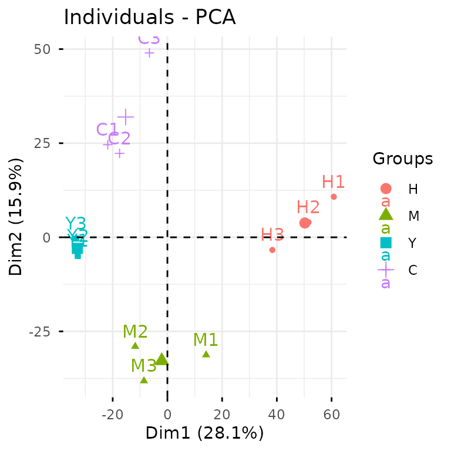
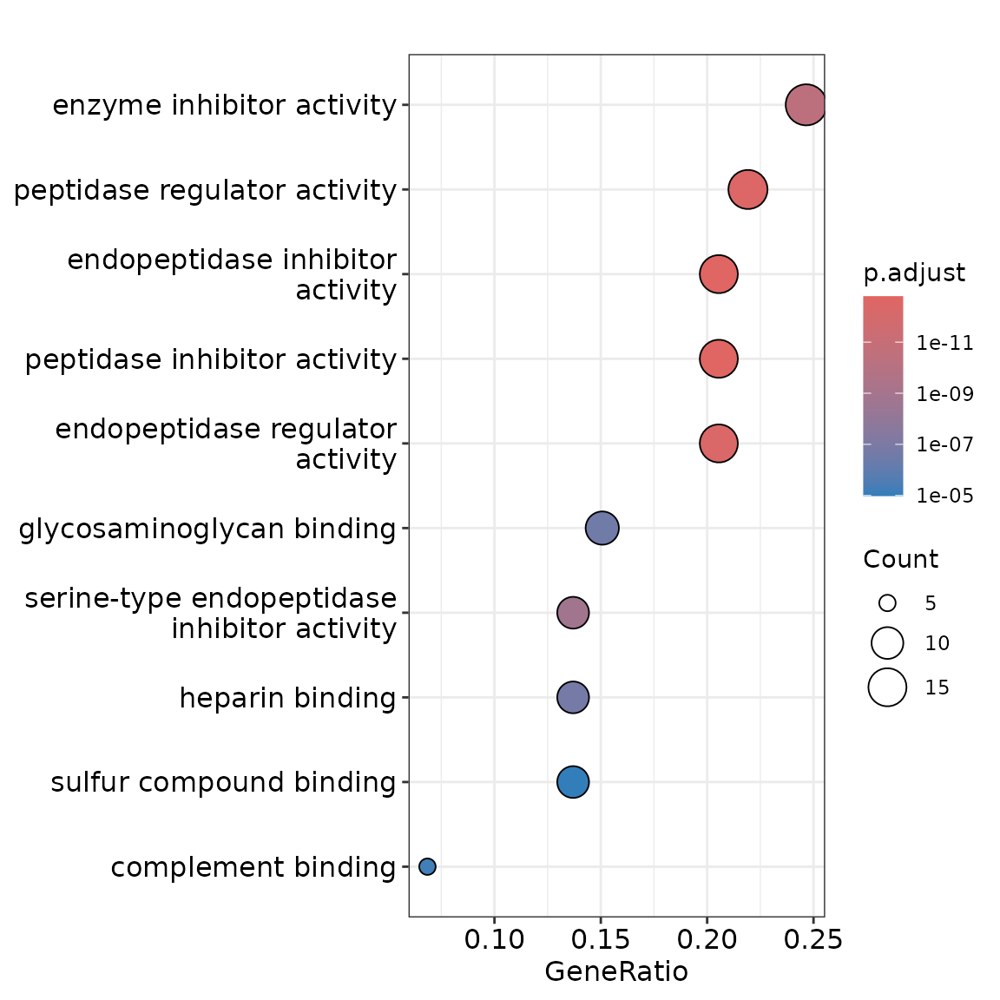
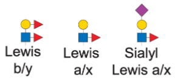
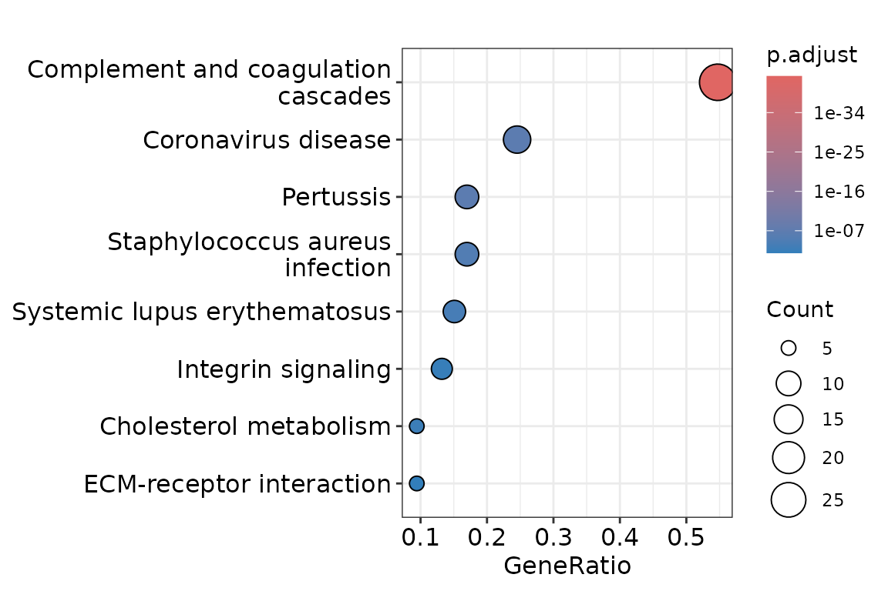

# Case Study: Glycoproteomics

This vignette walks you through a complete glycoproteomics analysis
using `glycoverse`. We’ll explore the full spectrum of glycoproteomics
data analysis, from data loading and preprocessing to statistical
analysis and visualization. We’ll also dive into advanced glycan
structure analysis, including motif quantification and derived trait
analysis. Ready to dive in? Let’s go!

**Heads up:** `glycoverse` is built on `tidy` principles throughout. If
you’re new to `tidyverse` data analysis, we highly recommend checking
out Hadley Wickham’s excellent [R for Data
Science](https://r4ds.hadley.nz). Trust us, it’s worth the investment!

Quick readiness check:

- What’s a `tibble`?
- How do you filter rows in a `tibble`?
- What’s the modern alternative to `for` loops?
- What’s the `|>` operator?
- What makes data “tidy”?

## TL;DR

In case you’re in a hurry…

``` r
# Load the packages
library(tidyverse)
library(glycoverse)

# Preprocess the data
clean_exp <- auto_clean(real_experiment)

# Perform PCA
pca_res <- gly_pca(clean_exp)
autoplot(pca_res)

# Perform differential expression analysis
limma_res <- gly_limma(clean_exp)
get_tidy_result(limma_res)

# Perform motif analysis
motifs <- c(
  lewis_by = "dHex(??-?)Hex(??-?)[dHex(??-?)]HexNAc(??-",
  lewis_ax = "Hex(??-?)[dHex(??-?)]HexNAc(??-",
  sia_lewis_ax = "NeuAc(??-?)Hex(??-?)[dHex(??-?)]HexNAc(??-"
)
motif_exp <- quantify_motifs(clean_exp, motifs)
motif_anova_res <- gly_anova(motif_exp)
get_tidy_result(motif_anova_res, "main_test")

# Perform derived trait analysis
trait_exp <- derive_traits(clean_exp)
trait_anova_res <- gly_anova(trait_exp)
get_tidy_result(trait_anova_res, "main_test")
```

## Loading the Packages

We first load the `tidyverse` package, as usual.

``` r
library(tidyverse)
#> ── Attaching core tidyverse packages ──────────────────────── tidyverse 2.0.0 ──
#> ✔ dplyr     1.2.0     ✔ readr     2.2.0
#> ✔ forcats   1.0.1     ✔ stringr   1.6.0
#> ✔ ggplot2   4.0.2     ✔ tibble    3.3.1
#> ✔ lubridate 1.9.5     ✔ tidyr     1.3.2
#> ✔ purrr     1.2.1     
#> ── Conflicts ────────────────────────────────────────── tidyverse_conflicts() ──
#> ✖ dplyr::filter() masks stats::filter()
#> ✖ dplyr::lag()    masks stats::lag()
#> ℹ Use the conflicted package (<http://conflicted.r-lib.org/>) to force all conflicts to become errors
```

Just like `tidyverse`, `glycoverse` is a meta-package that loads a
collection of specialized packages all at once.

``` r
library(glycoverse)
#> ── Attaching core glycoverse packages ───────────────── glycoverse 0.3.0.9000 ──
#> ✔ glyclean 0.12.2     ✔ glyparse 0.5.7 
#> ✔ glydet   0.10.4     ✔ glyread  0.9.2 
#> ✔ glydraw  0.3.1      ✔ glyrepr  0.10.1
#> ✔ glyexp   0.14.0     ✔ glystats 0.7.0 
#> ✔ glymotif 0.13.1     ✔ glyvis   0.5.1 
#> ── Conflicts ───────────────────────────────────────── glycoverse_conflicts() ──
#> ✖ glyclean::aggregate()  masks stats::aggregate()
#> ✖ dplyr::filter()        masks stats::filter()
#> ✖ lubridate::intersect() masks dplyr::intersect(), base::intersect()
#> ✖ dplyr::lag()           masks stats::lag()
#> ✖ lubridate::setdiff()   masks dplyr::setdiff(), base::setdiff()
#> ✖ dplyr::setequal()      masks base::setequal()
#> ✖ lubridate::union()     masks dplyr::union(), base::union()
#> ℹ Use the conflicted package (<http://conflicted.r-lib.org/>) to force all conflicts to become errors
```

## Reading the Data

Data import is typically your first step in any analysis. For this
tutorial, we’ll use the `real_experiment` dataset that comes with
`glyexp`. This is a real-world N-glycoproteomics dataset from 12
patients across four liver conditions: healthy controls (H), hepatitis
(M), cirrhosis (Y), and hepatocellular carcinoma (C), with 3 samples per
condition.

``` r
real_experiment
#> 
#> ── Glycoproteomics Experiment ──────────────────────────────────────────────────
#> ℹ Expression matrix: 12 samples, 4262 variables
#> ℹ Sample information fields: group <fct>
#> ℹ Variable information fields: peptide <chr>, peptide_site <int>, protein <chr>, protein_site <int>, gene <chr>, glycan_composition <comp>, glycan_structure <struct>
```

For your own projects, the `glyread` package can import data from
virtually any mainstream glycoproteomics software—pGlyco3,
MSFragger-Glyco, Byonic, you name it. Each software has its own
dedicated import function. For instance, data from pGlyco3 with
pGlycoQuant quantification can be loaded using
`read_pglyco3_pglycoquant()`. Check out [Get Started with
glyread](https://glycoverse.github.io/glyread/articles/glyread.html) for
the full rundown.

The `real_experiment` object (like all outputs from `glyread` functions)
is an `experiment()` object. If you’ve worked with
`SummarizedExperiment` from Bioconductor, think of `experiment()` as its
tidy cousin. Essentially, it’s a smart data container that manages three
key components:

- **Expression matrix**: quantitative data with samples as columns and
  variables as rows
- **Sample information**: a tibble with sample metadata (group, batch,
  demographics, etc.)
- **Variable information**: a tibble with feature metadata (proteins,
  peptides, glycan compositions, etc.)

You can get these data components by using `get_expr_mat()`,
`get_sample_info()`, and `get_var_info()`.

``` r
get_expr_mat(real_experiment)[1:5, 1:5]
#>                                               C1         C2           C3
#> P08185-N176-Hex(5)HexNAc(4)NeuAc(2)           NA         NA     10655.62
#> P04196-N344-Hex(5)HexNAc(4)NeuAc(1)-1  414080036  609889761  78954431.49
#> P04196-N344-Hex(5)HexNAc(4)            581723113  604842244 167889901.32
#> P04196-N344-Hex(5)HexNAc(4)NeuAc(1)-2 3299649335 2856490652 957651065.86
#> P10909-N291-Hex(6)HexNAc(5)-1           30427048   34294394   6390129.81
#>                                                 H1         H2
#> P08185-N176-Hex(5)HexNAc(4)NeuAc(2)   3.105412e+04         NA
#> P04196-N344-Hex(5)HexNAc(4)NeuAc(1)-1           NA   11724908
#> P04196-N344-Hex(5)HexNAc(4)           6.977076e+08  703566323
#> P04196-N344-Hex(5)HexNAc(4)NeuAc(1)-2 2.600523e+09 3229968280
#> P10909-N291-Hex(6)HexNAc(5)-1         5.159133e+07   37479075
```

``` r
get_sample_info(real_experiment)
#> # A tibble: 12 × 2
#>    sample group
#>    <chr>  <fct>
#>  1 C1     C    
#>  2 C2     C    
#>  3 C3     C    
#>  4 H1     H    
#>  5 H2     H    
#>  6 H3     H    
#>  7 M1     M    
#>  8 M2     M    
#>  9 M3     M    
#> 10 Y1     Y    
#> 11 Y2     Y    
#> 12 Y3     Y
```

``` r
get_var_info(real_experiment)
#> # A tibble: 4,262 × 8
#>    variable   peptide peptide_site protein protein_site gene  glycan_composition
#>    <chr>      <chr>          <int> <chr>          <int> <chr> <comp>            
#>  1 P08185-N1… NKTQGK             1 P08185           176 SERP… Hex(5)HexNAc(4)Ne…
#>  2 P04196-N3… HSHNNN…            5 P04196           344 HRG   Hex(5)HexNAc(4)Ne…
#>  3 P04196-N3… HSHNNN…            5 P04196           344 HRG   Hex(5)HexNAc(4)   
#>  4 P04196-N3… HSHNNN…            5 P04196           344 HRG   Hex(5)HexNAc(4)Ne…
#>  5 P10909-N2… HNSTGC…            2 P10909           291 CLU   Hex(6)HexNAc(5)   
#>  6 P04196-N3… HSHNNN…            5 P04196           344 HRG   Hex(5)HexNAc(4)Ne…
#>  7 P04196-N3… HSHNNN…            6 P04196           345 HRG   Hex(5)HexNAc(4)   
#>  8 P04196-N3… HSHNNN…            5 P04196           344 HRG   Hex(5)HexNAc(4)dH…
#>  9 P04196-N3… HSHNNN…            5 P04196           344 HRG   Hex(4)HexNAc(3)   
#> 10 P04196-N3… HSHNNN…            5 P04196           344 HRG   Hex(4)HexNAc(4)Ne…
#> # ℹ 4,252 more rows
#> # ℹ 1 more variable: glycan_structure <struct>
```

For a deeper dive into `experiment()` objects, check out [Get Started
with glyexp](https://glycoverse.github.io/glyexp/articles/glyexp.html).

## Data Preprocessing

Raw quantification data needs preprocessing before analysis—that’s just
a fact of life in omics. Typical steps include normalization, missing
value imputation, and batch effect correction. Rather than making you
implement these tedious steps manually, `glyclean` provides a
comprehensive preprocessing pipeline. Just call `auto_clean()` on your
`experiment()` object and you’re good to go.

``` r
clean_exp <- auto_clean(real_experiment)
#> 
#> ── Normalizing data ──
#> 
#> ℹ No QC samples found. Using default normalization method based on experiment type.
#> ℹ Experiment type is "glycoproteomics". Using `normalize_median()`.
#> ✔ Normalization completed.
#> 
#> ── Removing variables with too many missing values ──
#> 
#> ℹ No QC samples found. Using all samples.
#> ℹ Applying preset "discovery"...
#> ℹ Total removed: 24 (0.56%) variables.
#> ✔ Variable removal completed.
#> 
#> ── Imputing missing values ──
#> 
#> ℹ No QC samples found. Using default imputation method based on sample size.
#> ℹ Sample size <= 30, using `impute_sample_min()`.
#> ✔ Imputation completed.
#> 
#> ── Aggregating data ──
#> 
#> ℹ Aggregating to "gfs" level
#> ✔ Aggregation completed.
#> 
#> ── Normalizing data again ──
#> 
#> ℹ No QC samples found. Using default normalization method based on experiment type.
#> ℹ Experiment type is "glycoproteomics". Using `normalize_median()`.
#> ✔ Normalization completed.
#> 
#> ── Correcting batch effects ──
#> 
#> ℹ Batch column  not found in sample_info. Skipping batch correction.
#> ✔ Batch correction completed.
```

Your data is now analysis-ready!

Want to customize the preprocessing steps? See [Get Started with
glyclean](https://glycoverse.github.io/glyclean/articles/glyclean.html)
for the full toolkit.

## Statistical Analysis and Visualization

Time for the fun part—statistical analysis and visualization! We’ll use
`glystats` for the number crunching and `glyvis` to make sense of the
results visually.

Let’s kick off with PCA to get a bird’s-eye view of our data structure.

``` r
plot_pca(clean_exp)  # from `glyvis`
```



`glyvis` isn’t designed for publication-ready figures, but it’s perfect
for quick exploratory visualization. Behind the scenes, `plot_pca()`
calls `gly_pca()` from `glystats` and renders the results.

You can also break this down into separate steps:

``` r
pca_res <- gly_pca(clean_exp)  # from `glystats`
autoplot(pca_res)  # from `glyvis`
```


We actually recommend the two-step approach, since it gives you more
flexibility with the results. You can create custom `ggplot2`
visualizations for publications or extract the underlying data when
reviewers ask for it.

`glystats` covers virtually all standard omics analyses. All functions
follow the same naming pattern: `gly_xxx()`—think `gly_anova()`,
`gly_ttest()`, `gly_roc()`, `gly_cox()`, `gly_wgcna()`, and so on. They
all take an `experiment()` object as their first argument.

The return format is consistent across all functions—a list with two
components:

- **`tidy_result`**: cleaned-up tibbles in tidy format. We’ve done the
  heavy lifting of organizing messy statistical output for you.
- **`raw_result`**: the original statistical objects. These are
  available when you need to dig deeper or perform advanced analyses.

`glystats` provides two helper functions to get the tidy result tibble
and the raw result list from a glystats result object:
`get_tidy_result()` and `get_raw_result()`. Let’s now see what the
`samples` tibble looks like:

``` r
get_tidy_result(pca_res, "samples")  # many tibbles, so we specify one of them
#> # A tibble: 144 × 4
#>    sample group    PC  value
#>    <chr>  <fct> <dbl>  <dbl>
#>  1 C1     C         1 -21.7 
#>  2 C1     C         2  24.7 
#>  3 C1     C         3   1.89
#>  4 C1     C         4   1.05
#>  5 C1     C         5 -11.5 
#>  6 C1     C         6  26.5 
#>  7 C1     C         7   5.81
#>  8 C1     C         8   5.21
#>  9 C1     C         9 -27.8 
#> 10 C1     C        10  -7.01
#> # ℹ 134 more rows
```

Notice the “group” column? That’s `glystats` being helpful— it
automatically pulls relevant metadata from your `experiment()` object
and includes it in the results wherever it makes sense.

Back to that
[`autoplot()`](https://ggplot2.tidyverse.org/reference/autoplot.html)
magic we saw earlier. It automatically recognizes different `glystats`
result types and plots accordingly— no manual specification needed. The
plots won’t win any beauty contests, but they’ll get your data insights
across fast.

The PCA clearly shows that our samples cluster nicely by
condition—always a good sign! Now let’s dive into differential
expression analysis using the tried-and-true `limma` package.

``` r
limma_res <- gly_limma(clean_exp, contrasts = "H_vs_C")  # from `glystats`
#> ℹ Number of groups: 4
#> ℹ Groups: "H", "M", "Y", and "C"
#> ℹ Pairwise comparisons will be performed, with levels coming first as reference groups.
get_tidy_result(limma_res)  # only one tibble here
#> # A tibble: 3,979 × 14
#>    variable       protein glycan_composition glycan_structure protein_site gene 
#>    <chr>          <chr>   <comp>             <struct>                <int> <chr>
#>  1 P08185-176-He… P08185  Hex(5)HexNAc(4)Ne… NeuAc(??-?)Hex(…          176 SERP…
#>  2 P04196-344-He… P04196  Hex(5)HexNAc(4)Ne… NeuAc(??-?)Hex(…          344 HRG  
#>  3 P04196-344-He… P04196  Hex(5)HexNAc(4)    Hex(??-?)HexNAc…          344 HRG  
#>  4 P04196-344-He… P04196  Hex(5)HexNAc(4)Ne… NeuAc(??-?)Hex(…          344 HRG  
#>  5 P10909-291-He… P10909  Hex(6)HexNAc(5)    Hex(??-?)HexNAc…          291 CLU  
#>  6 P04196-344-He… P04196  Hex(5)HexNAc(4)Ne… NeuAc(??-?)Hex(…          344 HRG  
#>  7 P04196-345-He… P04196  Hex(5)HexNAc(4)    Hex(??-?)HexNAc…          345 HRG  
#>  8 P04196-344-He… P04196  Hex(5)HexNAc(4)dH… dHex(??-?)Hex(?…          344 HRG  
#>  9 P04196-344-He… P04196  Hex(4)HexNAc(3)    Hex(??-?)HexNAc…          344 HRG  
#> 10 P04196-344-He… P04196  Hex(4)HexNAc(4)Ne… NeuAc(??-?)Hex(…          344 HRG  
#> # ℹ 3,969 more rows
#> # ℹ 8 more variables: log2fc <dbl>, AveExpr <dbl>, t <dbl>, p_val <dbl>,
#> #   p_adj <dbl>, b <dbl>, ref_group <chr>, test_group <chr>
```

Excellent! Now let’s identify significantly differentially expressed
glycoforms between HCC and healthy samples, then see what biological
pathways they’re involved in.

``` r
clean_exp |>
  filter_sig_vars(limma_res, p_adj_cutoff = 0.05, fc_cutoff = 2) |>
  gly_enrich_go() |>
  autoplot()
#> 
```



And that’s it—pathway enrichment in just a few lines! Here we filtered
the experiment to keep only significant variables and then performed
pathway enrichment. As this operation is so common, `glystats` provides
a dedicated function for it: `filter_sig_vars()`.

For the full statistical arsenal, check out [Get Started with
glystats](https://glycoverse.github.io/glystats/articles/glystats.html)
and [Get Started with
glyvis](https://glycoverse.github.io/glyvis/articles/glyvis.html).

## Advanced Motif Analysis

Up to now, we’ve covered standard glycoproteomics workflows. While
`glycoverse` certainly streamlines these analyses, it truly shines when
it comes to advanced glycan structure analysis.

Before diving into motifs, let’s get acquainted with
[`glyrepr::glycan_structure()`](https://glycoverse.github.io/glyrepr/reference/glycan_structure.html)
vectors.

``` r
clean_exp |>
  get_var_info() |>
  pull(glycan_structure)
#> <glycan_structure[3979]>
#> [1] NeuAc(??-?)Hex(??-?)HexNAc(??-?)Hex(??-?)[NeuAc(??-?)Hex(??-?)HexNAc(??-?)Hex(??-?)]Hex(??-?)HexNAc(??-?)HexNAc(??-
#> [2] NeuAc(??-?)Hex(??-?)HexNAc(??-?)[HexNAc(??-?)]Hex(??-?)[Hex(??-?)Hex(??-?)]Hex(??-?)HexNAc(??-?)HexNAc(??-
#> [3] Hex(??-?)HexNAc(??-?)Hex(??-?)[Hex(??-?)HexNAc(??-?)Hex(??-?)]Hex(??-?)HexNAc(??-?)HexNAc(??-
#> [4] NeuAc(??-?)Hex(??-?)HexNAc(??-?)Hex(??-?)[Hex(??-?)HexNAc(??-?)Hex(??-?)]Hex(??-?)HexNAc(??-?)HexNAc(??-
#> [5] Hex(??-?)HexNAc(??-?)Hex(??-?)HexNAc(??-?)Hex(??-?)[Hex(??-?)HexNAc(??-?)Hex(??-?)]Hex(??-?)HexNAc(??-?)HexNAc(??-
#> [6] NeuAc(??-?)Hex(??-?)HexNAc(??-?)Hex(??-?)[NeuAc(??-?)Hex(??-?)HexNAc(??-?)Hex(??-?)]Hex(??-?)HexNAc(??-?)HexNAc(??-
#> [7] Hex(??-?)HexNAc(??-?)Hex(??-?)[Hex(??-?)HexNAc(??-?)Hex(??-?)]Hex(??-?)HexNAc(??-?)HexNAc(??-
#> [8] dHex(??-?)Hex(??-?)HexNAc(??-?)Hex(??-?)[dHex(??-?)Hex(??-?)HexNAc(??-?)Hex(??-?)]Hex(??-?)HexNAc(??-?)HexNAc(??-
#> [9] Hex(??-?)HexNAc(??-?)Hex(??-?)[Hex(??-?)]Hex(??-?)HexNAc(??-?)HexNAc(??-
#> [10] NeuAc(??-?)Hex(??-?)HexNAc(??-?)Hex(??-?)[HexNAc(??-?)Hex(??-?)]Hex(??-?)HexNAc(??-?)HexNAc(??-
#> ... (3969 more not shown)
#> # Unique structures: 967
```

Just like [`integer()`](https://rdrr.io/r/base/integer.html) and
[`character()`](https://rdrr.io/r/base/character.html),
`glycan_structure()` is a specialized vector type. Some software (like
pGlyco3 and StrucGP) outputs structural information as text strings.
When you import this data using `glyread`, the `glyparse` package
automatically converts these strings into proper `glycan_structure()`
vectors and stores them in the variable information tibble. Note that
not all software provides structural data—some only give compositions.

Fortunately, our example dataset includes structural information,
opening up a world of advanced analytical possibilities. Let’s explore
motif analysis.

**Quick note:** The printed structures use IUPAC-condensed notation,
which we’ll also use for defining motifs below. Don’t worry if it looks
intimidating—we’ll include visual diagrams to help. That said, if you’re
planning to do serious structural analysis, learning IUPAC-condensed
notation is worth the investment. Check out [this
guide](https://glycoverse.github.io/glyrepr/articles/iupac.html) to get
started—it’s easier than it looks!

Lewis antigen epitopes are common structural motifs found on N-glycans.
Ignoring linkage specificity, we can define three main Lewis motif
families:



Here’s how we express these motifs in IUPAC-condensed notation:

``` r
motifs <- c(
  lewis_by = "dHex(??-?)Hex(??-?)[dHex(??-?)]HexNAc(??-",
  lewis_ax = "Hex(??-?)[dHex(??-?)]HexNAc(??-",
  sia_lewis_ax = "NeuAc(??-?)Hex(??-?)[dHex(??-?)]HexNAc(??-"
)
```

A couple of important points:

1.  We’re using generic monosaccharide names (“Hex” vs. “Glc”) to match
    typical glycoproteomics data resolution
2.  The “??-?” represents unknown linkages—a common limitation in mass
    spectrometry data

This level of structural ambiguity is typical in glycoproteomics. The
key is matching your motif definitions to your data’s resolution.

Here’s our research question: **How many glycosites show differential
Lewis antigen expression across conditions?** Without `glycoverse`, this
would be a nightmare to tackle manually. Take a moment to imagine the
pain of doing this by hand!

Now, the `glycoverse` solution:

``` r
motif_anova_res <- clean_exp |>
  quantify_motifs(motifs) |>  # quantify these motifs
  gly_anova()  # and perform ANOVA
#> ℹ Number of groups: 4
#> ℹ Groups: "H", "M", "Y", and "C"
#> ℹ Pairwise comparisons will be performed, with levels coming first as reference groups.

get_tidy_result(motif_anova_res, "main_test")
#> # A tibble: 828 × 14
#>    variable         protein protein_site motif gene  motif_structure term     df
#>    <glue>           <chr>          <int> <chr> <chr> <struct>        <chr> <dbl>
#>  1 A6NJW9-49-lewis… A6NJW9            49 lewi… CD8B2 dHex(??-?)Hex(… group     3
#>  2 A6NJW9-49-lewis… A6NJW9            49 lewi… CD8B2 Hex(??-?)[dHex… group     3
#>  3 A6NJW9-49-sia_l… A6NJW9            49 sia_… CD8B2 NeuAc(??-?)Hex… group     3
#>  4 O14786-150-lewi… O14786           150 lewi… NRP1  dHex(??-?)Hex(… group     3
#>  5 O14786-150-lewi… O14786           150 lewi… NRP1  Hex(??-?)[dHex… group     3
#>  6 O14786-150-sia_… O14786           150 sia_… NRP1  NeuAc(??-?)Hex… group     3
#>  7 O43866-226-lewi… O43866           226 lewi… CD5L  dHex(??-?)Hex(… group     3
#>  8 O43866-226-lewi… O43866           226 lewi… CD5L  Hex(??-?)[dHex… group     3
#>  9 O43866-226-sia_… O43866           226 sia_… CD5L  NeuAc(??-?)Hex… group     3
#> 10 O75437-244-lewi… O75437           244 lewi… ZNF2… dHex(??-?)Hex(… group     3
#> # ℹ 818 more rows
#> # ℹ 6 more variables: sumsq <dbl>, meansq <dbl>, statistic <dbl>, p_val <dbl>,
#> #   p_adj <dbl>, post_hoc <chr>
```

`quantify_motifs()` transforms your data into a new `experiment()`
object. Instead of quantifying individual glycans per glycosite, you now
have motif abundances per glycosite across samples. Since it’s still an
`experiment()` object, all `glystats` functions work
seamlessly—including `gly_anova()`.

Now we can answer our question using standard `tidyverse` operations,
since `motif_anova_res$tidy_result$main_test` is just a regular tibble:

``` r
motif_anova_res |>
  get_tidy_result("main_test") |>
  filter(p_adj < 0.05) |>
  group_by(motif) |>
  count()
#> # A tibble: 3 × 2
#> # Groups:   motif [3]
#>   motif            n
#>   <chr>        <int>
#> 1 lewis_ax        27
#> 2 lewis_by         9
#> 3 sia_lewis_ax    28
```

Want the specific glycosites with significant Lewis a/x epitopes? Easy:

``` r
motif_anova_res |>
  get_tidy_result("main_test") |>
  filter(p_adj < 0.05, motif == "lewis_ax") |>
  select(protein, protein_site)
#> # A tibble: 27 × 2
#>    protein protein_site
#>    <chr>          <int>
#>  1 O75882           731
#>  2 P00734           143
#>  3 P00734           155
#>  4 P00738           241
#>  5 P01011           271
#>  6 P01042           294
#>  7 P01877           205
#>  8 P01877            92
#>  9 P02675           394
#> 10 P02679            78
#> # ℹ 17 more rows
```

Here’s another common question: **Which pathways are enriched in
proteins that carry Lewis a/x epitopes?**

For this analysis, we don’t need motif quantification—we just need to
know which proteins have these motifs.
[`glymotif::add_motifs_lgl()`](https://glycoverse.github.io/glymotif/reference/add_motifs_int.html)
is perfect for this.

``` r
kegg_res <- clean_exp |>
  add_motifs_lgl(motifs) |>
  filter_var(lewis_ax) |>
  gly_enrich_kegg()

autoplot(kegg_res)
```



`add_motifs_lgl()` adds three new TRUE/FALSE columns (`lewis_by`,
`lewis_ax`, `sia_lewis_ax`) to the variable information. `filter_var()`
keeps only glycoforms with Lewis a/x epitopes. Finally,
`gly_enrich_kegg()` runs pathway enrichment on the remaining proteins.

`glymotif` has much more to offer beyond these examples. Dive deeper
with [Get Started with
glymotif](https://glycoverse.github.io/glymotif/articles/glymotif.html).

## Derived Trait Analysis

Let’s wrap up with derived traits—a clever analytical approach developed
by the N-glycomics community for glycome characterization. Classic
examples include:

- High-mannose glycan proportion
- Core-fucosylation rate within complex glycans
- Average sialylation per galactose residue

`glydet` adapts this concept for glycoproteomics by treating each
glycosite as its own mini-glycome. This enables site-specific trait
calculation and much richer biological insights.

Using `glydet` couldn’t be simpler:

``` r
trait_exp <- derive_traits(clean_exp)  # from `glydet`
trait_exp
#> 
#> ── Traitproteomics Experiment ──────────────────────────────────────────────────
#> ℹ Expression matrix: 12 samples, 3864 variables
#> ℹ Sample information fields: group <fct>
#> ℹ Variable information fields: protein <chr>, protein_site <int>, trait <chr>, gene <chr>, explanation <chr>
```

That’s it! Just like `quantify_motifs()`, `derive_traits()` creates a
new `experiment()` object, but now with trait values per glycosite per
sample.

The variable information shows what we’re working with:

``` r
get_var_info(trait_exp)
#> # A tibble: 3,864 × 6
#>    variable      protein protein_site trait gene  explanation                   
#>    <glue>        <chr>          <int> <chr> <chr> <chr>                         
#>  1 A6NJW9-49-TM  A6NJW9            49 TM    CD8B2 Proportion of high-mannose gl…
#>  2 A6NJW9-49-TH  A6NJW9            49 TH    CD8B2 Proportion of hybrid glycans …
#>  3 A6NJW9-49-TC  A6NJW9            49 TC    CD8B2 Proportion of complex glycans…
#>  4 A6NJW9-49-MM  A6NJW9            49 MM    CD8B2 Abundance-weighted mean of ma…
#>  5 A6NJW9-49-CA2 A6NJW9            49 CA2   CD8B2 Proportion of bi-antennary gl…
#>  6 A6NJW9-49-CA3 A6NJW9            49 CA3   CD8B2 Proportion of tri-antennary g…
#>  7 A6NJW9-49-CA4 A6NJW9            49 CA4   CD8B2 Proportion of tetra-antennary…
#>  8 A6NJW9-49-TF  A6NJW9            49 TF    CD8B2 Proportion of fucosylated gly…
#>  9 A6NJW9-49-TFc A6NJW9            49 TFc   CD8B2 Proportion of core-fucosylate…
#> 10 A6NJW9-49-TFa A6NJW9            49 TFa   CD8B2 Proportion of arm-fucosylated…
#> # ℹ 3,854 more rows
```

The “trait” column lists all the derived traits we can analyze.

`glydet` comes with a comprehensive set of built-in traits:

- **`TM`**: Proportion of high-mannose glycans
- **`TH`**: Proportion of hybrid glycans  
- **`TC`**: Proportion of complex glycans
- **`MM`**: Average number of mannoses within high-mannose glycans
- **`CA2`**: Proportion of bi-antennary glycans within complex glycans
- **`CA3`**: Proportion of tri-antennary glycans within complex glycans
- **`CA4`**: Proportion of tetra-antennary glycans within complex
  glycans
- **`TF`**: Proportion of fucosylated glycans
- **`TFc`**: Proportion of core-fucosylated glycans
- **`TFa`**: Proportion of arm-fucosylated glycans
- **`TB`**: Proportion of glycans with bisecting GlcNAc
- **`SG`**: Average degree of sialylation per galactose
- **`GA`**: Average degree of galactosylation per antenna
- **`TS`**: Proportion of sialylated glycans

These represent the most widely used traits in glycomics literature.

Let’s identify glycosites with significantly different core-fucosylation
levels (TFc) across conditions:

``` r
trait_exp |>
  filter_var(trait == "TFc") |>  # from `glyexp`
  gly_anova() |>
  get_tidy_result("main_test") |>
  filter(p_adj < 0.05)
#> ℹ Number of groups: 4
#> ℹ Groups: "H", "M", "Y", and "C"
#> ℹ Pairwise comparisons will be performed, with levels coming first as reference groups.
#> # A tibble: 20 × 14
#>    variable     protein protein_site trait gene  explanation term     df   sumsq
#>    <glue>       <chr>          <int> <chr> <chr> <chr>       <chr> <dbl>   <dbl>
#>  1 P00450-397-… P00450           397 TFc   CP    Proportion… group     3 2.21e-2
#>  2 P00738-211-… P00738           211 TFc   HP    Proportion… group     3 8.53e-2
#>  3 P00738-241-… P00738           241 TFc   HP    Proportion… group     3 7.84e-4
#>  4 P00748-249-… P00748           249 TFc   F12   Proportion… group     3 5.48e-4
#>  5 P01591-71-T… P01591            71 TFc   JCHA… Proportion… group     3 7.71e-2
#>  6 P01877-92-T… P01877            92 TFc   IGHA2 Proportion… group     3 2.02e-3
#>  7 P02679-78-T… P02679            78 TFc   FGG   Proportion… group     3 3.65e-3
#>  8 P02765-176-… P02765           176 TFc   AHSG  Proportion… group     3 9.41e-5
#>  9 P02790-240-… P02790           240 TFc   HPX   Proportion… group     3 6.29e-2
#> 10 P03952-494-… P03952           494 TFc   KLKB1 Proportion… group     3 2.31e-3
#> 11 P04004-86-T… P04004            86 TFc   VTN   Proportion… group     3 6.50e-3
#> 12 P04278-396-… P04278           396 TFc   SHBG  Proportion… group     3 2.99e-2
#> 13 P05090-98-T… P05090            98 TFc   APOD  Proportion… group     3 1.70e-2
#> 14 P06681-621-… P06681           621 TFc   C2    Proportion… group     3 5.49e-2
#> 15 P0C0L4-1328… P0C0L4          1328 TFc   C4A   Proportion… group     3 1.74e-2
#> 16 P0C0L4-1391… P0C0L4          1391 TFc   C4A   Proportion… group     3 4.17e-5
#> 17 P19652-103-… P19652           103 TFc   ORM2  Proportion… group     3 6.44e-2
#> 18 P25311-112-… P25311           112 TFc   AZGP1 Proportion… group     3 3.05e-2
#> 19 P25311-128-… P25311           128 TFc   AZGP1 Proportion… group     3 5.19e-4
#> 20 P43652-33-T… P43652            33 TFc   AFM   Proportion… group     3 5.47e-3
#> # ℹ 5 more variables: meansq <dbl>, statistic <dbl>, p_val <dbl>, p_adj <dbl>,
#> #   post_hoc <chr>
```

Once again, it’s just that straightforward.

This just scratches the surface of `glydet`’s capabilities. The real
power lies in defining custom traits tailored to your research
questions. Explore the possibilities in [Get Started with
glydet](https://glycoverse.github.io/glydet/articles/glydet.html).

## What’s Next?

This vignette has given you a taste of `glycoverse` in action through a
real-world glycoproteomics workflow. But we’ve barely scratched the
surface! Now that you’ve got the basics down, you’re ready to unlock the
full potential of each package.

Here’s your roadmap to mastering each component:

- **[glyexp](https://glycoverse.github.io/glyexp/articles/glyexp.html)**
  — Master experiment objects and data manipulation
- **[glyread](https://glycoverse.github.io/glyread/articles/glyread.html)**
  — Import and organize glycoproteomics data
- **[glyclean](https://glycoverse.github.io/glyclean/articles/glyclean.html)**
  — Build custom preprocessing pipelines  
- **[glystats](https://glycoverse.github.io/glystats/articles/glystats.html)**
  — Explore the full statistical toolkit
- **[glyvis](https://glycoverse.github.io/glyvis/articles/glyvis.html)**
  — Create stunning visualizations
- **[glymotif](https://glycoverse.github.io/glymotif/articles/glymotif.html)**
  — Define and analyze custom motifs
- **[glydet](https://glycoverse.github.io/glydet/articles/glydet.html)**
  — Create powerful derived traits
- **[glyenzy](https://glycoverse.github.io/glyenzy/articles/glyenzy.html)**
  — Explore enzyme-substrate relationships (we didn’t cover this one,
  but it’s fascinating!)
- **[glyrepr](https://glycoverse.github.io/glyrepr/articles/glyrepr.html)**
  — Master glycan structure representation
- **[glyparse](https://glycoverse.github.io/glyparse/articles/glyparse.html)**
  — Parse and convert structural formats
- **[glydraw](https://glycoverse.github.io/glydraw/articles/glydraw.html)**
  — Draw glycan structures
- **[glydb](https://glycoverse.github.io/glydb/articles/glydb.html)** —
  Access glycan databases
- **[glyanno](https://glycoverse.github.io/glyanno/articles/glyanno.html)**
  — Annotate glycan structures
- **[glysmith](https://glycoverse.github.io/glysmith/articles/glysmith.html)**
  — Master the full analytical pipeline

Happy glycan hunting! 🧬
